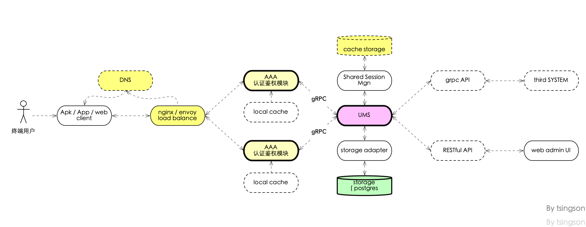

# go-ums -- a golang based User /member Management Subsystem (UMS) 

 

## Update

this project in WIP status.

 [previous chinese document in here ](./README_cn.md)

 项目重构中, [最早的中文文档在这里 ](./README_cn.md)

 Go-ums 继续独立开发中, 目标是成为一个可以独立使用, 也可以与其他业务系统集成使用的用户( 会员) 管理子系统

## License 

MIT 
