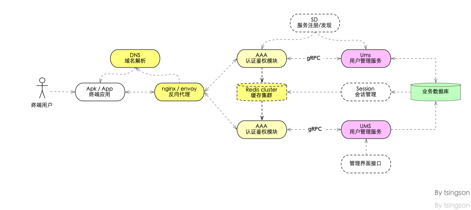

# go-ums -- a golang based User Management Subsystem (UMS)
~~一个 gin-goinc/gin 练手项目~~, 分布式 web 开源项目, 核心由 golang 开发,  提供用户管理(user-management-subsystem) / AAA 认证/鉴权/授 / 多业务会话共享与管理等, 以支持分布式部署及云部署为主要目标

----

> ### [check out docs 查看文档](./docs/readme.md)
> #### 1. design 设计文档
>
> 1. [模型设计 v0.1.0](./docs/design/model-design-cn.md) chinese 
> 2. [go-ums v0.1.0 测试/编译/运行](./docs/design/build-test.md)
>
> #### 2. dev guide 开发指南
>
> 1. [golang 开发环境设置](./docs/guide/dev-env-setup.md) chinese 
> 2. [golang http 测试撰写](./docs/guide/httptest.md) chinese

----

## 0. movition 动机

就是一个 go 练手项目, 同时, 也计划用于 goim 项目的辅助扩展, 使用 goim 的用户管理
1. 手上有类似用户管理项目在进行重构
2. 受到 [https://github.com/developer-learning/reading-go/issues/348](https://github.com/developer-learning/reading-go/issues/348) 相关讨论启发
3. ~~本项目, 申请为 [https://github.com/developer-learning/reading-go](https://github.com/developer-learning/reading-go) 练手项目~~
4. **重点更新1**: 受某项目进度变更影响, 本项目延迟支持 gin-gonic/gin( 原因: 不想采用 gin 的数据 binding 方式, 这是 gin 三大特点之一), 修改为 web 部分采用 fasthttp , 内部接口采用 gRPC.  同时, 本项目代码, 支持 gin-gonic/gin 非常容易( 业务代码对边缘同时支持 gRPC / web / RESTful / java, 所以, web部分可与任何 go web 组件结合)  , 如有咨询或交流, 请提 issues 
5. **重点更新2**: 项目中使用的开源库, 除 gRPC / websocket 相关部分以外, 小部分可能与 go 标准库并不兼容, 但核心业务功能尽量使用"标准"库或与"标准"兼容库

## 1. porject code layout 代码组织

项目组织参考 [https://github.com/golang-standards/project-layout](https://github.com/golang-standards/project-layout)

代码使用 golang 1.12+ 并以 go module 进行管理

## 2. business logic 业务场景

如下
- [ ] 用户管理
  - [ ] 提供用户管理抽象接口 interface 
  - [ ] 用户注册
  - [ ]  用户登录与认证
  - [ ] 用户授权与鉴权
     - [ ] 用户会话管理, 包括会话生命周期管理
     - [ ] 用户会话存储, 提供抽象接口interface , 如支持内存/文件/redis
  - [ ] 用户管理, 主要是用户创建/查询(条件查询)/屏蔽(拒绝登录,但不删除)/重激活
  - [ ] 支持用户生命周期管理
    - [ ] 试用期
    - [ ] 会员期期限
    - [ ] VIP会员期限
  - [ ] 支持用户 profile 字段扩展/自定义
  - [ ] 支持用户与业务关系绑定
    - [ ] 支持 goim 鉴权
    - [ ] 支持 goim 房间号绑定(授权) /房间切换 /多房间并活
  - [ ] 提供用户活动日志记录
- [ ] 接口
  - [ ] 提供 web RESTful 客户端( JSON) API
  - [ ] 提供 web page 客户端( web form ) 
  - [ ] 提供命令行客户端
  - [ ] 提供 tcp 客户端接口
  - [ ] 提供 gRPC 接口
  - [ ] SDK
    - [ ] android SDK( java )
    - [ ] nodeJS SDK
    - [ ] python SDK
 - [ ] 第三方集成
  - [ ] 支持 OAuth 2.0  
- [ ] 存储与缓存
  - [ ] 提供抽象接存储接口 interface 
  - [ ] 提供文件存储
  - [ ] 提供数据库存储 ( postgres / mysql / mongoDB...)
- [ ] 部署与维护
  - [ ] 独立单实例部署
    - [ ] 支持 HA 双活
    - [ ] 支持限流
    - [ ] 支持 fail-over
  - [ ] 分布式部署 
      - [ ] 支持 HA 双活
      - [ ] 支持负载均衡

## 3. data model /data-flow /architecutre 数据结构设计与架构组织

待续.....

## 4. dev plan 开发计划( 延迟............)

- [ ] ~~截止2019/05/16,  完成用户数据模型设计, 数据流转设计并文档化~~
- [ ] ~~截止2019/05/23,  完成原型设计并测试通过~~

> 抱歉, 事实上, go-ums 的另一版本, 已经在试商用环境中测试了一个半月后, 并成功替换了商用环境中原来的 AAA 与 UMS 
> 但本项目还在继续进行中, 毕竟是开源版本, 需要处理两件事, 一是去除商业部署中的一些特殊逻辑, 二是考虑通用性, 并易于扩展或改写

## 5.   如何参与本项目

1. 在本项目 issues 中交流讨论, 尤其欢迎有心得有经验的朋友指点
2. fork 本项目, 提交代码/文档/patch 修订, 注意: 代码提交前, 请尽量在 issues 中进行修订/扩展的业务场景/技术/问题进行充分讨论
3. 为本项目撰写关联技术文章, 翻译文档

所有贡献者, 将在贡献者同意情况下, 列示于本项目中(不限于个人简介/技术博客/文章连接....)

## 6. MIT 授权
本项目遵从 MIT 授权方式

## 7. 作者与贡献者
1.  项目发起人 [tsingson 三明智](https://github.com/tsingson) 写于中国深圳 [小罗号口琴音乐中心](https://tsingson.github.io/music/about-studio/),  技术博客[https://tsingson.github.io/](https://tsingson.github.io/) 2019/05/09

