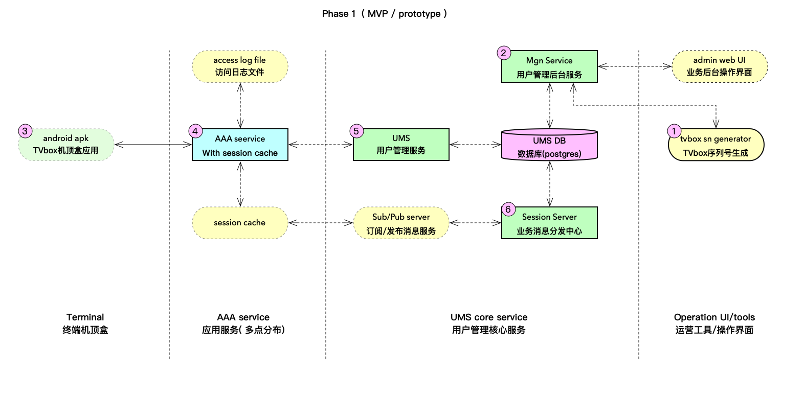
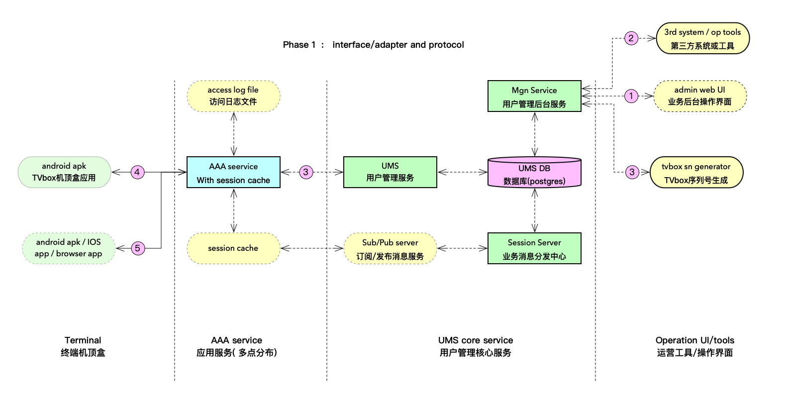
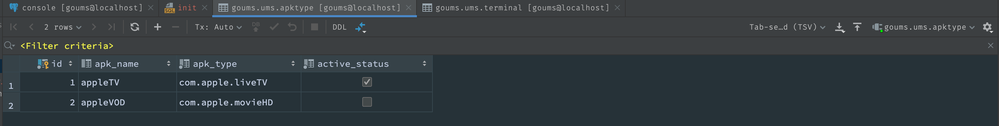
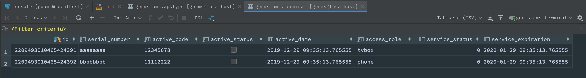

# goums -- a golang based Terminal /Member / User Management Sub-system (UMS) with AAA


## 0. Status

this project back to active development, and re-design all.

Thie project aims for a Minimum Viable Product (MVP) or a prototype of UMS.

 

## 1. purpose

a general terminal / member management sub-system for TV-box ( android STB )  with AAA

> AAA --- Authentication（认证） / Authorization （授权） / Accounting (计费）

### 1.1  feature highlight ( maybe change  until v1.0.0 release ):

* collect all business logic in UMS , support multiple AAA server with local session cache

* support multiple storage with interface ( adapter to multiple storage driver )

* support administrator / intergration API  via  gRPC and  RESTful

* add operator/administrator web UI for operation

### 1.2  Phase 1 plan

  a MVP / prototype demo only, for TV-box / STB terminal 

## 2. design ( draft )

### 2.1 architecutre



go-ums-interface-201912.png

### 2.2 Business process / scenario:

* In the diagram, mark 1 is  the serial number generator  ( tvsn ) 
will generate the hardware serial number of the TV box / set-top box, import it into the database, and save it in an Excel file. The excel file is send to the factory,  and the serial number is burned to the TV box / set-top box when it is produced In the product as hardware ID
*  mark 2 is Mgn, 
 provides services for the background management UI ( admin web UI ) , and provides business integration adapter ( gRPC / RESTful ... ) , support  tools like tvsn  and 3rd system / application to manages TV box / set-top box terminals, including terminal activation / deactivation, member account lifecycle management corresponding to the box etc.
*  mark 3 is android APK inside TV box / set-top box,
APK  access AAA for register ( active ) / login ( authentication ) / get the TV-guide portal IP address and access token ( authorization ) 
*  mark 4 and 5 , the AAA / UMS provide member magement and some business logic like AAA....
* mark 6 , the Session server provide session storage , and sync session status change to AAA local cache 


  


### 2.3. protocols between modules



* In the diagram, mark 1 is the HTTP protocol ( RESTful ),  JSON encode 
* mark 2,   gRPC with protobuf encode 
* Mark 3 ,  gRPC with flatbuffers encode  (  used in all modules inside go-UMS )
* Mark 4,   TCP with bytes payload ( via customized encrypt  )
* Mark 5,   HTTP with bytes payload ( via customized encrypt )


### 2.4  data models 

#### 2.4.1  objects diagram

#### 2.4.2  sql and funtions in postgresql

default DB use postgresql 11+

```
-- create database in pg 11+
drop database if exists goums;
create database goums;
-- create schema
drop schema ums cascade;
create schema ums;


-- create extension if not exists "uuid-ossp" with schema queue;
-- apk type
drop table if exists ums.apktype;
create table if not exists ums.apktype
(
id int generated always as identity (cache 100)
  primary key,
apk_name varchar(64),
apk_type varchar(64) not null,
active_status boolean default true not null
);

insert
into
  ums.apktype
(apk_name,apk_type,active_status)
values
('appleTV','com.apple.liveTV',true),
('appleVOD','com.apple.movieHD',false);

drop table if exists ums.terminal;
create table if not exists ums.terminal
(
id bigint not null
  primary key default queue.id_generator(),
serial_number varchar(64) not null,
active_code varchar(64) not null,
active_status boolean default false not null,
active_date timestamp default now(),
access_role varchar(32) default 'tvbox'::character varying not null,
service_status smallint default 0,
service_expiration timestamp default (now() + ((31)::double precision * '1 day'::interval))
);

comment on column ums.terminal.service_status is 'service status define:
0 default
1 actived
2 suspend
3 disabled
4 deleted';

insert
into
  ums.terminal
(serial_number,active_code,access_role)
values
('aaaaaaaa','12345678','tvbox'),
('bbbbbbbb','11112222','phone');

```

use jetbrain's Datagrip to initial db







#### 2.4.3  IDL in protobuffers / flatbuffers 


## 4. tech stack

1. base on golang and high performance go module like gRPC / flatbuffers / fasthttp / fastcache ......
2. web UI base react javascript / HTML / css ......
3. postgresql 11+

   

## 4. License

MIT
