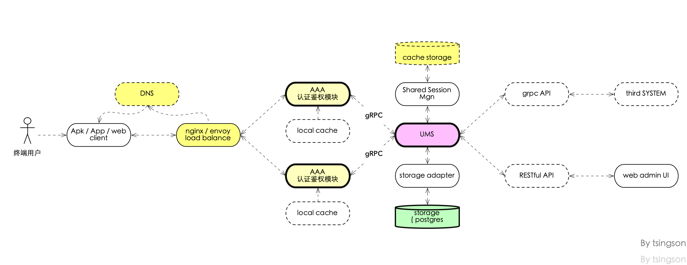

# go-ums -- a golang based User /member Management Subsystem (UMS) with AAA 

 

## 0. Status

this project in WIP status.

 check out [document  , chinese for now ](./README_cn.md)

 项目重构中, [最早的中文文档在这里 ](./README_cn.md)

## 1. data model /data-flow /architecutre

2019/10/28 update:

architecutre update:

Main change:

* collect all business logic in UMS , support multiple AAA with local cache 

* support multiple storage with interface ( adapter to multiple storage driver )

* support administrator / intergration API  via  gRPC and  RESTful 

* add new web UI for administrator and monitor 

 

## 3. License 

MIT 
