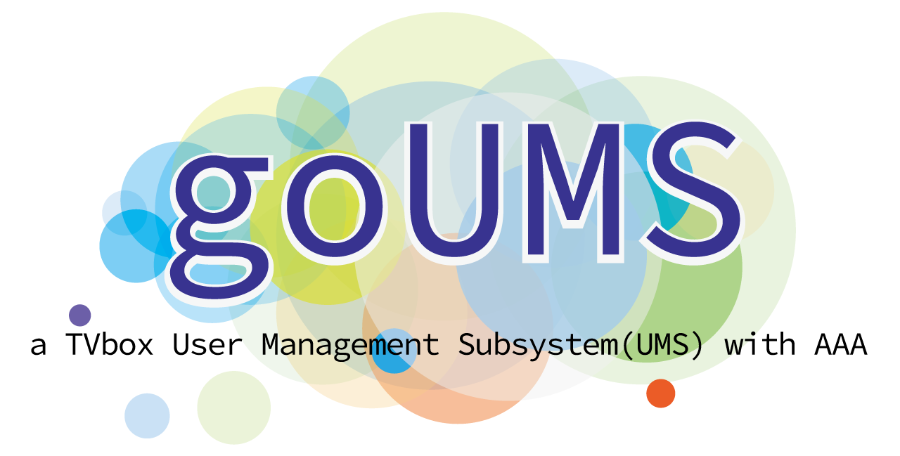
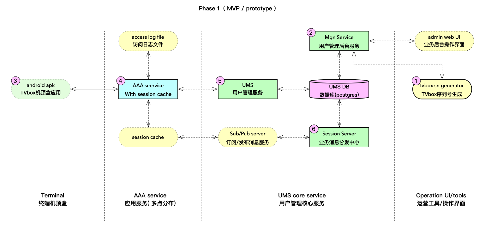
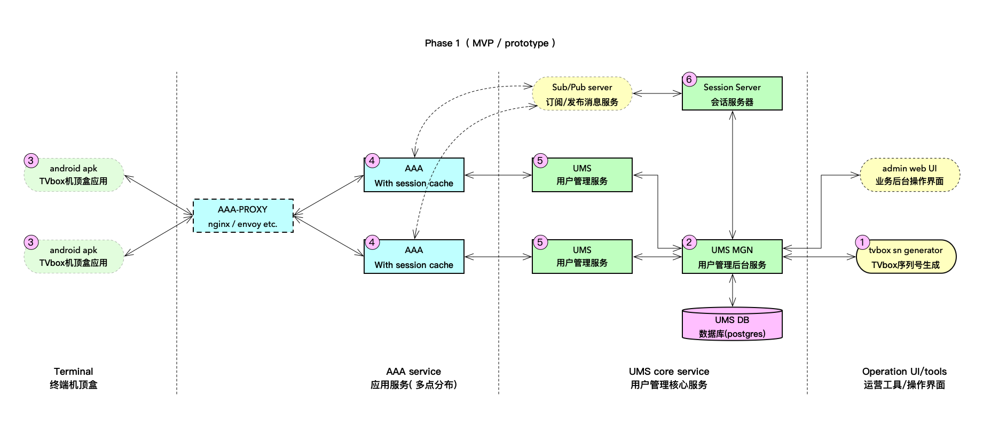
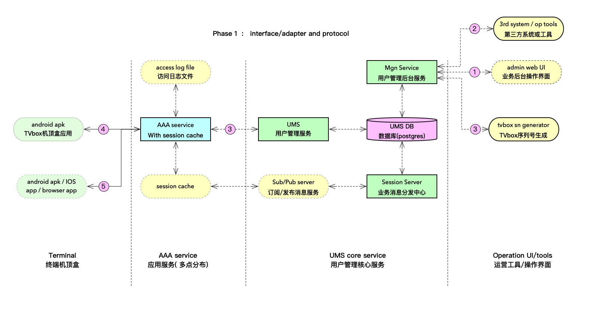
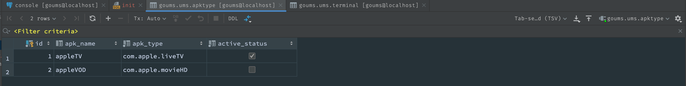
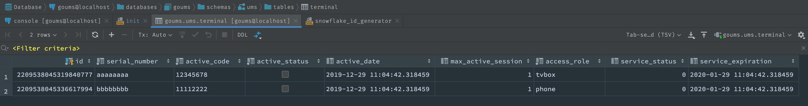
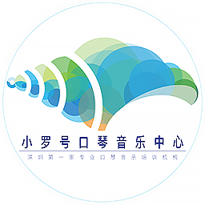

# goums -- a golang based TVbox Terminal  User Management Sub-system (UMS) with AAA


## 0. Status & Press 

this project back to active development, and re-design all.

**Work in progress: breaking changes possible.**

Thie project aims for a Minimum Viable Product (MVP) or a prototype of UMS.

### TODO list 
- [x] javascript websocket with flatbuffers serialized , done
- [ ] redesign model and ICD 
- [ ] rewrite step by step design/development docs ( English and Chinese )
- [ ] redesign adapter ( interface in go )


## 1. purpose

a general terminal / member management sub-system for TV-box ( android STB )  with AAA

> AAA --- Authentication（认证） / Authorization （授权） / Accounting (计费）

### 1.1  feature highlight ( maybe change  until v1.0.0 release ):

* collect all business logic in UMS , support multiple AAA server with local session cache

* support multiple storage with interface ( adapter to multiple storage driver )

* support administrator / intergration API  via  gRPC and  RESTful

* add operator/administrator web UI for operation

### 1.2  Phase 1 plan

  a MVP / prototype demo only, for TV-box / STB terminal 

## 2. design ( draft )

### 2.1 architecutre

draft at 2019/12/28 ( DEPRECATED )


update at 2020/01/01



> change:
> * add proxy 
> * change scrope of logic component and data-flow 


### 2.2 Business process / scenario:

* In the diagram, mark 1 is  the serial number generator  ( tvsn ) 
will generate the hardware serial number of the TV box / set-top box, import it into the database, and save it in an Excel file. The excel file is send to the factory,  and the serial number is burned to the TV box / set-top box when it is produced In the product as hardware ID
*  mark 2 is Mgn, 
 provides services for the background management UI ( admin web UI ) , and provides business integration adapter ( gRPC / RESTful ... ) , support  tools like tvsn  and 3rd system / application to manages TV box / set-top box terminals, including terminal activation / deactivation, member account lifecycle management corresponding to the box etc.
*  mark 3 is android APK inside TV box / set-top box,
APK  access AAA for register ( active ) / login ( authentication ) / get the TV-guide portal IP address and access token ( authorization ) 
*  mark 4 and 5 , the AAA / UMS provide member magement and some business logic like AAA....
* mark 6 , the Session server provide session storage , and sync session status change to AAA local cache 


  


### 2.3. protocols between modules



* In the diagram, mark 1 is the HTTP protocol ( RESTful ),  JSON encode 
* mark 2,   gRPC with protobuf encode 
* Mark 3 ,  gRPC with flatbuffers encode  (  used in all modules inside go-UMS )
* Mark 4,   TCP with bytes payload ( via customized encrypt  )
* Mark 5,   HTTP with bytes payload ( via customized encrypt )


### 2.4  data models 

#### 2.4.1  objects diagram

#### 2.4.2  sql and funtions in postgresql

default DB use postgresql 11+

```
-- create database in pg 11+
drop database if exists goums;
create database goums;
-- create schema
drop schema ums cascade;
create schema ums;

-- create extension if not exists "uuid-ossp" with schema queue;
-- apk type
drop table if exists ums.apktype;
create table if not exists ums.apktype
(
id int generated always as identity (cache 100)
  primary key,
apk_name varchar(64),
apk_type varchar(64) not null,
active_status boolean default true not null
);

insert
into
  ums.apktype
(apk_name,apk_type,active_status)
values
('appleTV','com.apple.liveTV',true),
('appleVOD','com.apple.movieHD',false);

drop table if exists ums.terminal;
create table if not exists ums.terminal
(
id bigint not null
  primary key default queue.id_generator(),
serial_number varchar(64) not null,
active_code varchar(64) not null,
active_status boolean default false not null,
active_date timestamp default now(),
max_active_session bigint default 1,
access_role varchar(32) default 'tvbox'::character varying not null,
service_status smallint default 0,
service_expiration timestamp default (now() + ((31)::double precision * '1 day'::interval))
);

comment on column ums.terminal.service_status is 'service status define:
0 default
1 actived
2 suspend
3 disabled
4 deleted';

insert
into
  ums.terminal
(serial_number,active_code,access_role)
values
('aaaaaaaa','12345678','tvbox'),
('bbbbbbbb','11112222','phone');

```

use jetbrain's Datagrip to initial db







#### 2.4.3  IDL in protobuffers / flatbuffers 

/apis/protoums.proto

```
syntax = "proto3";
package protoums;

/// Result define sn response
message Result {
    int64 tid = 1;
    int64 code = 2;
    string message = 3;
}

/// AccessResult  result
message AccessResult {
    AccessProfile Me = 1;
    string Token = 2;
}

/// AccessProfile access
message AccessProfile {
    string UserID = 1;
    string RegisterDate = 2;
    string Expiration = 3;
}

enum ServiceStatusType {
    default = 0;
    active = 1;
    suspend = 2;
    disabled = 3;
    deleted = 4;
}

enum OperationType {
    UnDefine =0;
    insert = 1;
    update = 2;
    delete = 3;
}

message TerminalList {
    int64 Count = 1;
    repeated TerminalProfile List = 2;
}

/// TerminalProfile 认证成功后返回用户详细档案
message TerminalProfile {
    int64 userID = 1;
    bool activeStatus = 2;
    int64 activeDate = 3;
    int64 maxActiveSession = 4;
    ServiceStatusType serviceStatus = 5;
    int64 serviceExpiration = 6;
    string serialNumber = 7;
    string activeCode = 8;
    string accessRole = 9;
    OperationType operation = 10;
}


```

/apis/flatums.fbs

```
namespace flatums;

attribute "priority";

enum ServiceStatusType : int {
  default = 0,
  active = 1,
  suspend = 2,
  disabled = 3,
  deleted = 4,
}

enum OperationType : int {
  UnDefine = 0,
  INSERT = 1,
  UPDATE = 2,
  DELETE = 3,
}

/// Result define sn response
table Result {
  tid:long;
  code:long;
  message:string;
}

/// AccessResult  result
table AccessResult {
  Me:AccessProfile;
  Token:string;
}

/// AccessProfile access
table AccessProfile {
  UserID:string;
  RegisterDate:string;
  Expiration:string;
}

table TerminalList {
  Count:long;
  List:[TerminalProfile];
}

/// TerminalProfile  
table TerminalProfile {
  userID:long;
  activeStatus:bool;
  activeDate:long;
  maxActiveSession:long;
  serviceStatus:ServiceStatusType;
  serviceExpiration:long;
  serialNumber:string;
  activeCode:string;
  accessRole:string;
  operation:OperationType;
}


```

## 3. tech stack and depends

### 3.1 depends 

* [nats-server](https://nats.io/) -- a simple, secure and high performance open source messaging system for cloud native applications, IoT messaging, and microservices architectures.
* [liftbridge](https://liftbridge.io/) -- Lightweight, fault-tolerant message streams
* [postgresql 11+](https://postgresql.org) -- The World's Most Advanced Open Source Relational Database

### 3.2 golang module / framework
base on golang and high performance go module like 
* [gRPC](https://grpc.io) -- A high performance, open-source universal RPC framework. from google
* [flatbuffers](https://google.github.io/flatbuffers/) -- an efficient cross platform serialization library for C++, C#, C, Go, Java, JavaScript, Lobster, Lua, TypeScript, PHP, Python, and Rust. It was originally created at Google for game development and other performance-critical applications.
* [fasthttp](https://github.com/valyala/fasthttp) -- Fast HTTP package for Go. Tuned for high performance. Zero memory allocations in hot paths.
* [jackc/pgx](https://github.com/jackc/pgx) -- pgx is a pure Go driver and toolkit for PostgreSQL. The driver part of pgx is compatible with database/sql but also offers a native interface similar in style to database/sql that offers better performance and more features

### 3.3 web UI
web admin UI base
*  [react-admin](https://github.com/marmelab/react-admin)  -- A frontend Framework for building B2B applications running in the browser on top of REST/GraphQL APIs, using ES6, React and Material Design and react
* [websockets/ws](https://github.com/websockets/ws)  javascript websocket

### 3.4 THANKS
Thanks a lot to all open source founder/contriber!!  

and thanks a lot to  [jetbrain](https://www.jetbrains.com) for my favorite Goland IDE / Datagrip IDE / Webstorm IDE, thanks [GOlang](https://golang.org), those tools save many time so that i can share more happy time with my family and friends.

**Any issues / discussion / PRs r welcome!!**


## 4. FAQ 
1. why gRPC + flatbuffers inside goums, not gRPC + protobuffers , or RESTful ( http + JSON ) ?
> to supports fast scaling deployment on daemon, every AAA with local cache ( session / member profile... etc ) to service multi-region, millions of terminals. UMS / AAA must synchronize session data / authentication data fast enouth.  via flatbuffers , fast decoding,  smaller binary data transfer to get  higher performance
>
> protobufers is balance choose for 3rd system / tools to interactive with goums
>
> RESTful  for old style web application only 

## 5. License

MIT


-----

goums logo design by [tsingson](https://tsingson.github.io), ye, it's me :p

