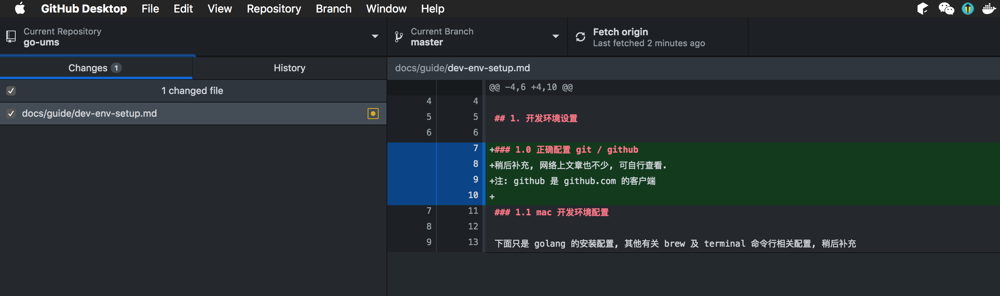
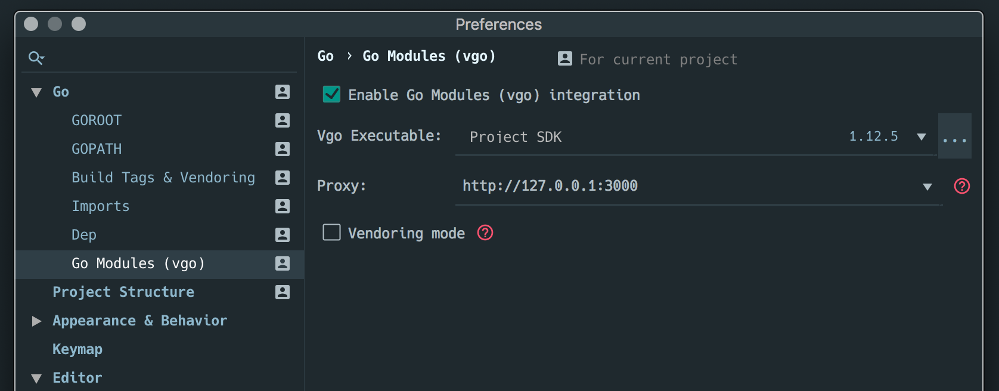
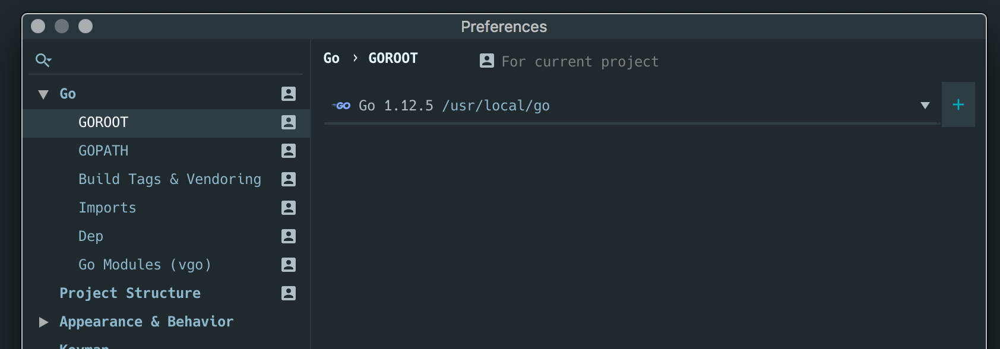
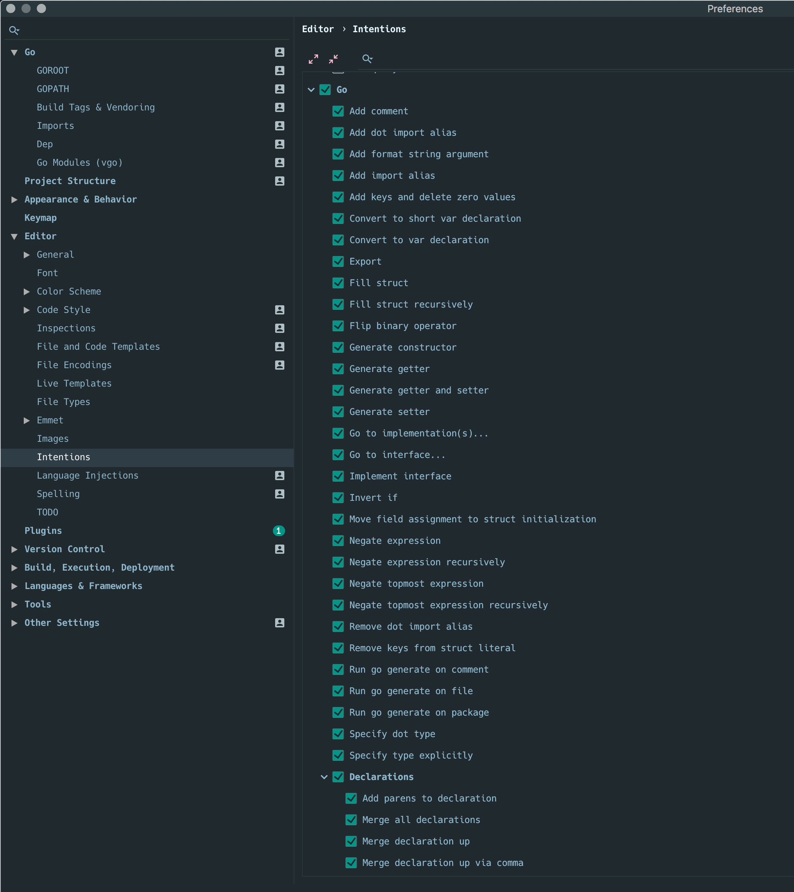

# golang 开发环境设置


## 1. 开发环境设置

### 1.0 正确配置 git / github 
稍后补充, 网络上文章也不少, 可自行查看.
注: github 是 github.com 的客户端



### 1.1 mac 开发环境配置

下面只是 golang 的安装配置, 其他有关 brew 及 terminal 命令行相关配置, 稍后补充

#### 1.1.1 golang 安装

下载 [https://dl.google.com/go/go1.12.5.darwin-amd64.pkg](https://dl.google.com/go/go1.12.5.darwin-amd64.pkg) 后双击该下载包后, 按提示安装, 即可

安装成功后, 验证

```
/usr/local/go/bin/go version
```

运行后提示

```
go version go1.12.5 darwin/amd64
```

OK, golang 安装成功


#### 1.1.2 环境配置

注意, 在我的 mac 电脑中, 我的用户名是 qinshen 

计划我的 golang 源码在以下路径

```
/Users/qinshen/go/
```

修改 ~/.bash_profile 文件, 增加以下内容

```
export GOCACHE="/Users/qinshen/go/pkg/cache"
export GO111MODULE=on
export GOPROXY=http://127.0.0.1:3000
# export GOPROXY="https://athens.azurefd.net"
export PATH=$PATH:/Users/qinshen/go/bin

export PS1='$PWD \$  '
alias b='go install -gcflags=-trimpath=OPATH -asmflags=-trimpath=OPATH -a -tags netgo -ldflags "-w -s "'
```

稍后, 再打开 terminal 终端命令行, 以上环境变量即生效


注意以下两行, 请自行配置, 必要时, 安装 vpn 

```
export GOPROXY=http://127.0.0.1:3000
# export GOPROXY="https://athens.azurefd.net"
```

一般情况下, 使用

```
# export GOPROXY=http://127.0.0.1:3000
export GOPROXY="https://athens.azurefd.net"
```

即可(前提是, 你的电脑可以顺利访问外网)


我的配置是, 自带 vpn , 在 docker 中安装了 [https://github.com/gomods/athens](https://github.com/gomods/athens) , 具体操作见 [https://docs.gomods.io/install/shared-team-instance/](https://docs.gomods.io/install/shared-team-instance/)


以下行

```
export PATH=$PATH:/Users/qinshen/go/bin
```

只是把 go 编译后的可执行文件, 加在 PATH 方便运行


#### 1.1.3 编辑软件或IDE

IDE 采用 vscode 或 jetbrains goland 

个人推荐采用 goland 
安装插件 [https://plugins.jetbrains.com/plugin/11556-generate-struct-tags-for-golang](https://plugins.jetbrains.com/plugin/11556-generate-struct-tags-for-golang) 用于 goland struct 结构体自动生成 json tag 


## 2. 项目配置
### 2.1 项目路径
我的项目路径是
```
/Users/qinshen/go/src/github.com/tsingson/go-ums
```

在 goland 中配置为




及打开 go module 支持 ( 最新版本 goland 会自动提示并在确认后自动创建)

 


 及打开所有 go 的语法检查项

 


## 3. 待续....

## 4. 作者与贡献者

1. 项目发起人 tsingson 三明智 写于中国深圳 小罗号口琴音乐中心,  技术博客https://tsingson.github.io/ 2019/05/09
